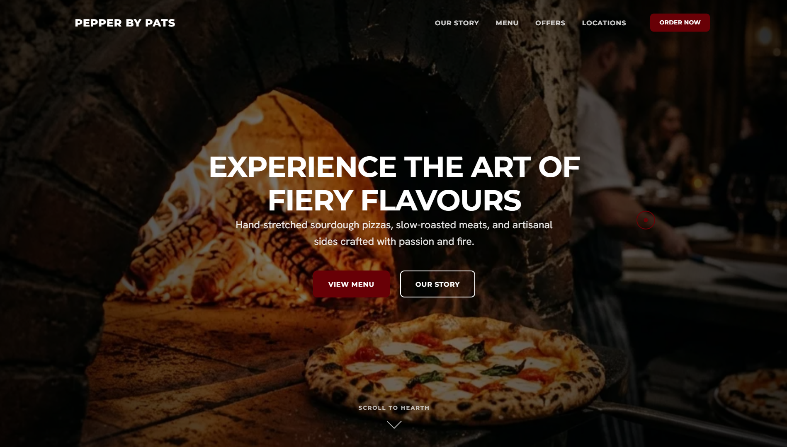
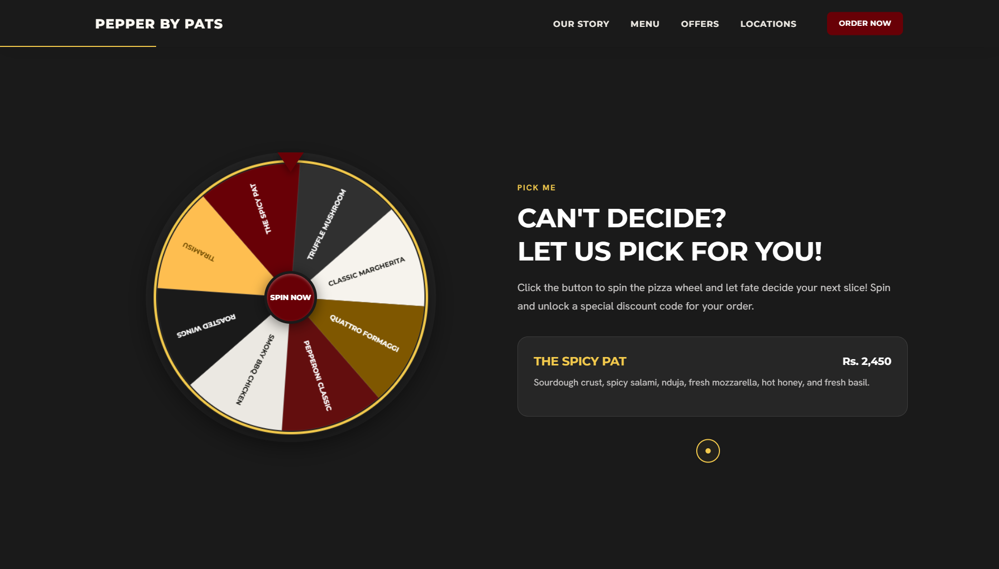
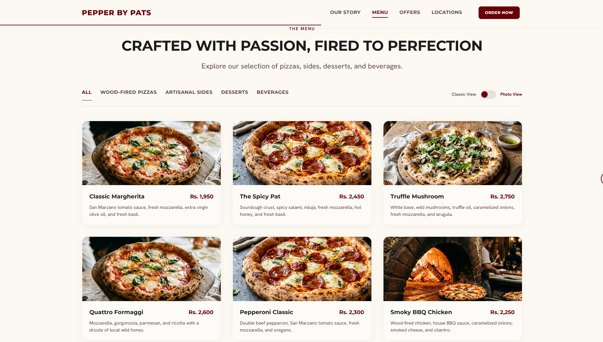
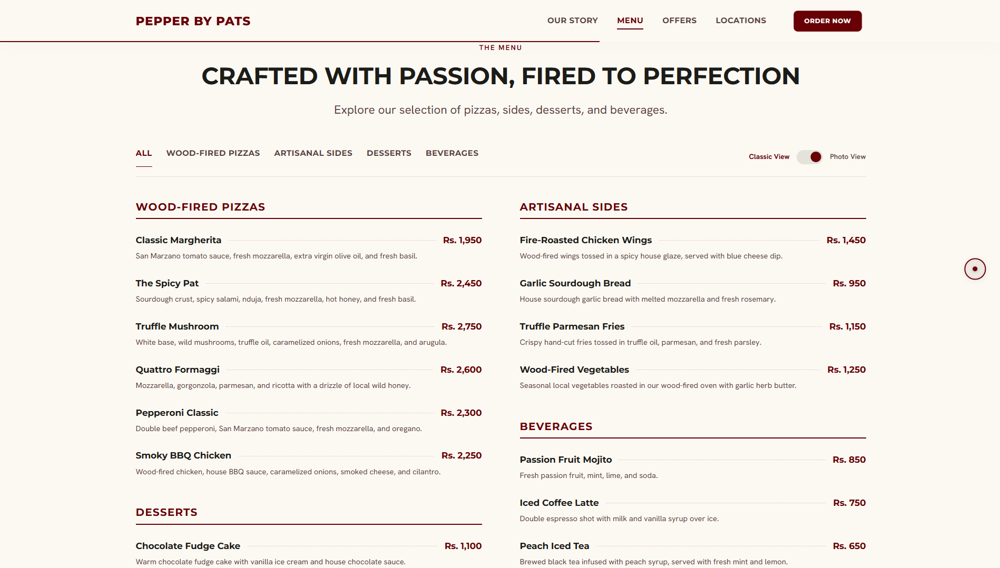

# Pepper by Pats 🍕🔥

An elegant, interactive web presence for **Pepper by Pats**, Kandy's premier artisanal wood-fired pizzeria. This application features high-performance UI animations, interactive elements like a pizza spin wheel recommendation tool, responsive modern design, and layout toggle views.

## 🌟 Key Features

*   **Premium Interactive Pizza Wheel:** Stuck on what to order? Spin the pizza wheel to get a curated selection and unlock a special discount code.
*   **Signature Creations & Menu:** A comprehensive, categorized menu showcasing pizzas, artisanal sides, desserts, and beverages.
*   **Dynamic Layout Views:** Switch between a modern **Photo View** grid and a classic minimal **Classic View** for the menu.
*   **Theme Controls & Visuals:** Designed with smooth transitions, responsive grid layouts, and custom parallax background effects.
*   **Fully Responsive:** optimized for mobile, tablet, and desktop viewing.

## 📸 Preview & Screenshots

### Desktop Hero Section

### Interactive Pizza Wheel

### Dynamic Menu Views (Photo Grid vs. Classic List)

  
  

## 🛠️ Project Structure

The project structure is organized as follows:
*   `index.html` - The main structure, semantic components, and markup.
*   `style.css` - Custom vanilla CSS stylesheet containing modular custom properties, animations, and theme configurations.
*   `app.js` - Client-side logic for the interactive pizza wheel canvas, coupon system, views toggle, and navigation.
*   `assets/` - Image assets, including pizza photos, chef banners, and backgrounds.

## 🚀 How to Run Locally

Since this is a lightweight static web application, you can run it directly:

1.  **Direct Open:** Double-click `index.html` in your file explorer to open it in your browser.
2.  **Live Server (Recommended):** If you use VS Code, install the "Live Server" extension, then click **Go Live** at the bottom status bar for hot-reloading capability.
